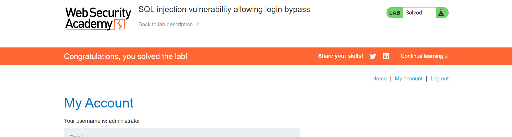

# Lab: SQL injection vulnerability in login form

**Difficulty:** Apprentice

**Link:** https://portswigger.net/web-security/sql-injection/lab-login-bypass

## Objective : exploit this vulnerability to login as admin.

## Analysis
**Context:** Login Form

**Sink:**  The login form is used in the WHERE clause of a SQL query to filter the products displayed on the page.

**Payload:** ' OR 1=1 -- 

**Result:**
SELECT * FROM users WHERE username = '' OR 1=1 -- AND password = '[PASSWORD]'
'--' was used to comment out the rest of the query.

