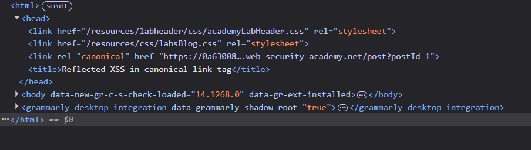

# Lab: Reflected XSS in canonical link tag

**Difficulty:** Practitioner
**Link:** https://portswigger.net/web-security/cross-site-scripting/contexts/lab-canonical-link-tag

## Objective : Perform a cross-site scripting attack on the home page that injects an attribute that calls the 'alert' function. To assist with your exploit, you can assume that the simulated user will press the following key combinations: ALT+SHIFT+X, CTRL+ALT+X, ALT+X. 

## Analysis
**Context:** Home Page, URL, Elements Panel
**Sink:** The searched word is reflected inside the `<link>` tag in the `<head>` section.

I noticed that when I change the value of the parameter 'postID', the changes will be reflected on the webpage.

 

Then, it was clearly stated previously stated that to assist the exploit we can assume that the user will press the following key combinations.

So, it will be requiring a different payload rather than common payloads like these: 

</textarea>

For exploitation I tried to check whether 'alert(1)' can be functional via URl, tried that but didn't worked.

Further, `?'accesskey='x'onclick='alert(1)` used this payload in the URL section,as it was the part through which the changes were reflected on the web page. In this payload the single quote `'` tricks the browser into ending the current text field early, allowing the rest of your input to be read as executable code.

It then injects a specific trigger (onclick) and a keyboard shortcut (accesskey), forcing the malicious script to run whenever the user clicks the element or presses the 'x' key combo.

The lab is solved, by injecting the payload mentioned above

