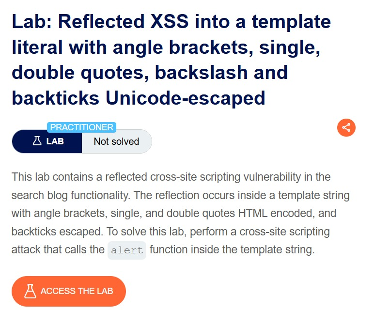
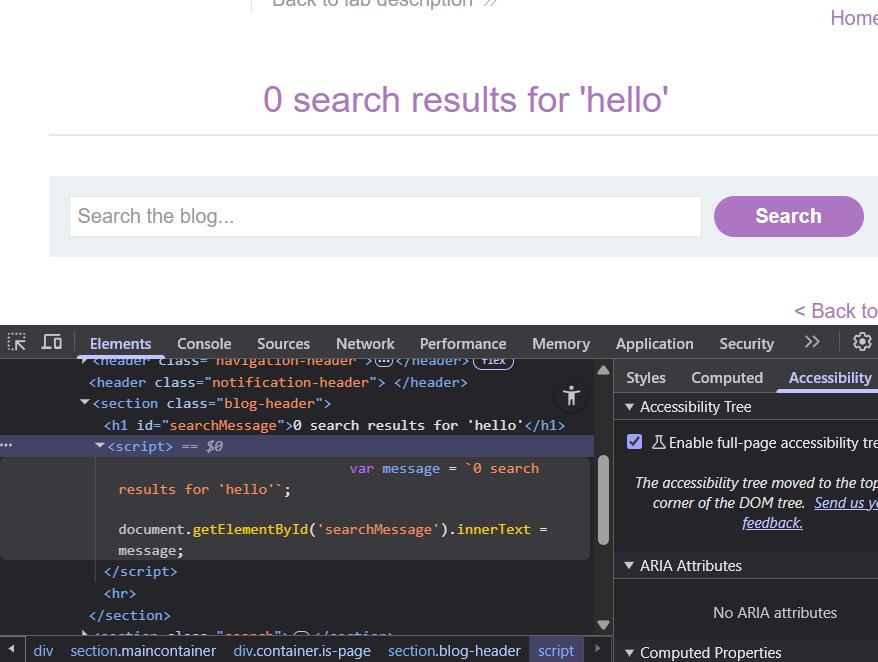
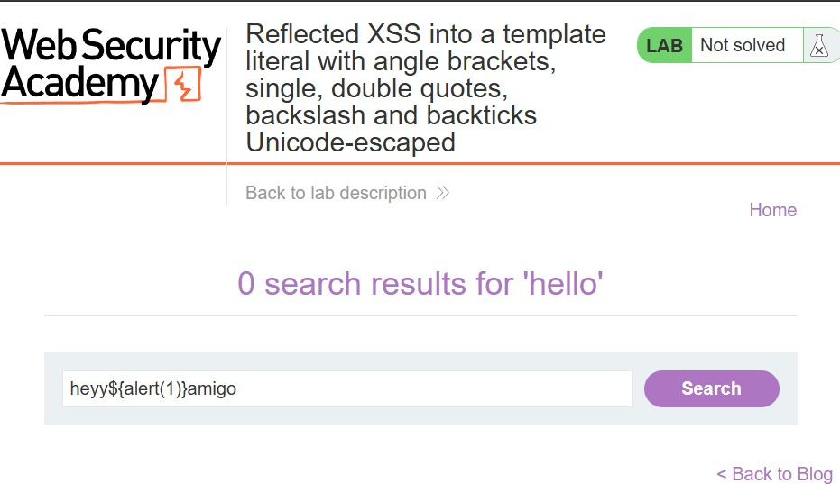
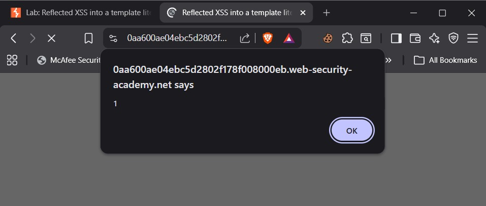
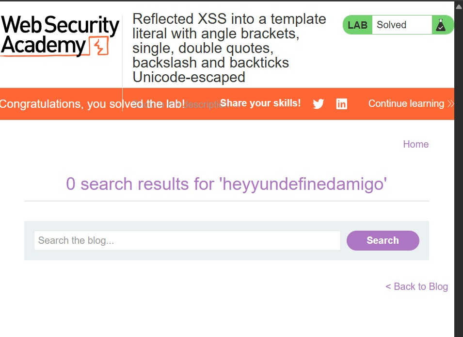

# Lab: Reflected XSS into a template literal with angle brackets, single, double quotes, backslash and backticks Unicode-escaped

**Difficulty:** Practitioner

**Link:** https://portswigger.net/web-security/cross-site-scripting/contexts/lab-javascript-template-literal-angle-brackets-single-double-quotes-backslash-backticks-escaped

## Objective : perform a cross-site scripting attack that calls the alert function inside the template string.

## Given: This lab contains a reflected cross-site scripting vulnerability in the search blog functionality. The reflection occurs inside a template string with angle brackets, single, and double quotes HTML encoded, and backticks escaped. 

## Analysis
**Context:** Blog Comment, Elements Panel

**Sink:** The comment is reflecetd in the JS script present in the source code.

Template Literals: Represented by `.`.Template literal is a JavaScript function for creating strings that allow for easy embedding variables with `${}` and creating multi line strings, making dynamic string construction cleaner and more readable than traditional concatenation with `+`.

I firstly looked out where the input is being reflected in the code. For that I searched "hello" in the search bar of the web page. And the string "hello" was reflected in `script` section of the `blog-header` section

`var message = 0 search results for 'hello';document.getElementById('searchMessage').innerText = message;`

We know that whatever input we provide will be executed in the backend between backticks, and will be injected into the code. So, for the payload, we'll insert our payload directly into our string so that the code executes in the backend, and our payload also gets executed.

The payload I searched in the searched bar is `heyy${alert(1)}amigo`. When this will be inserted into the code during execution, the payload alert(1) will be executed because of the property of template literal that allow for easy embedding variables with `${}`. After doing so, the lab is solved.

