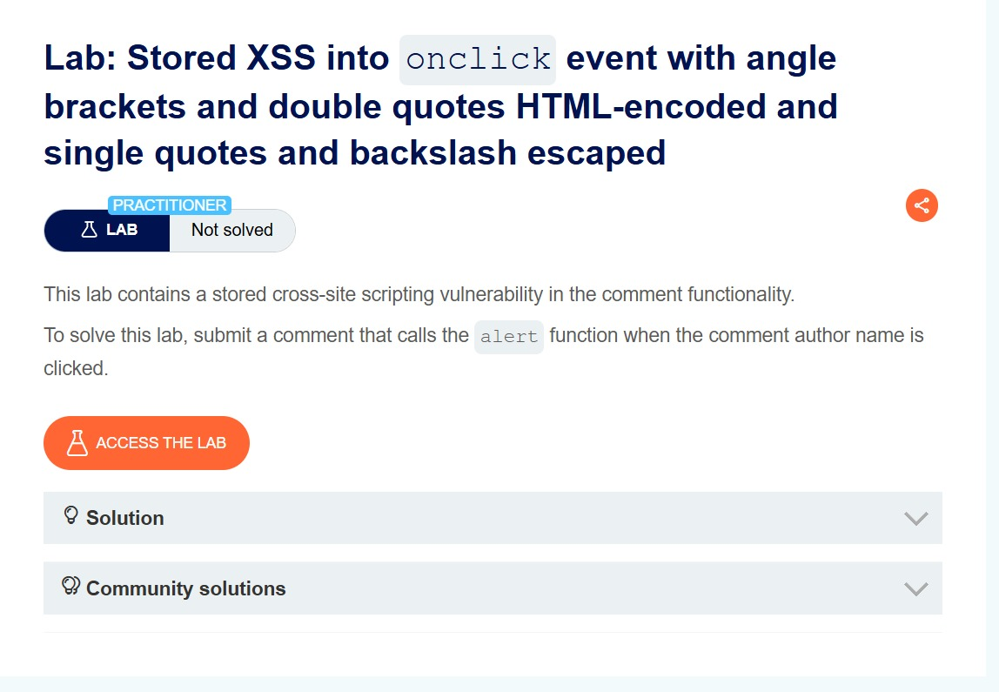
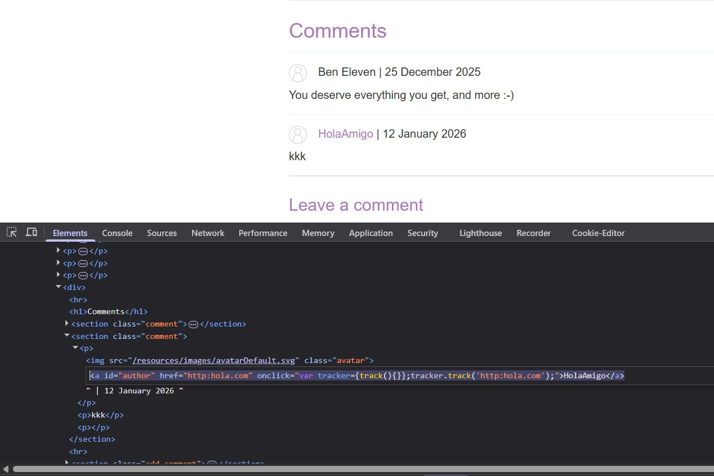
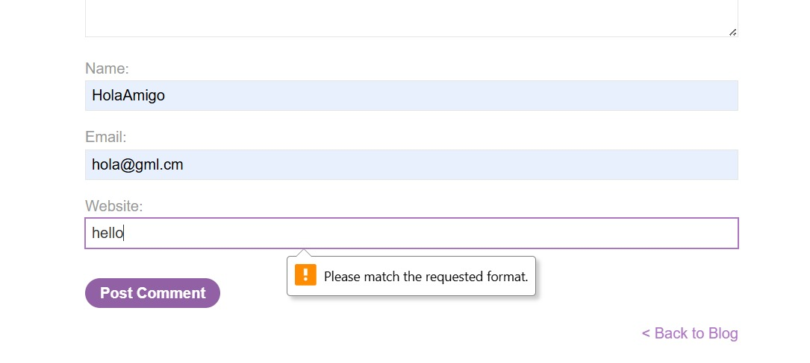
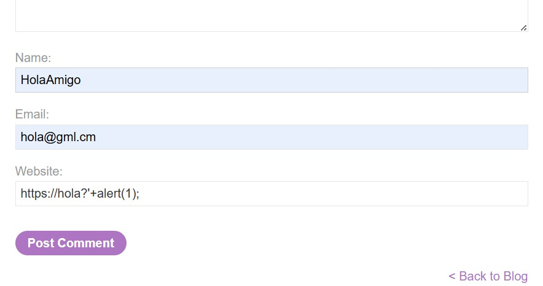
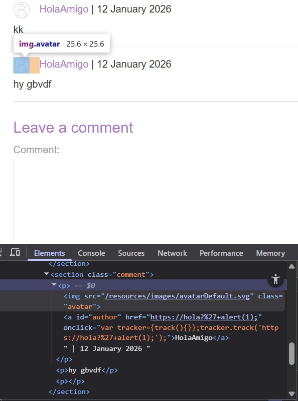
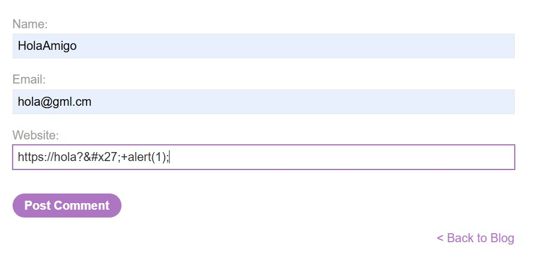
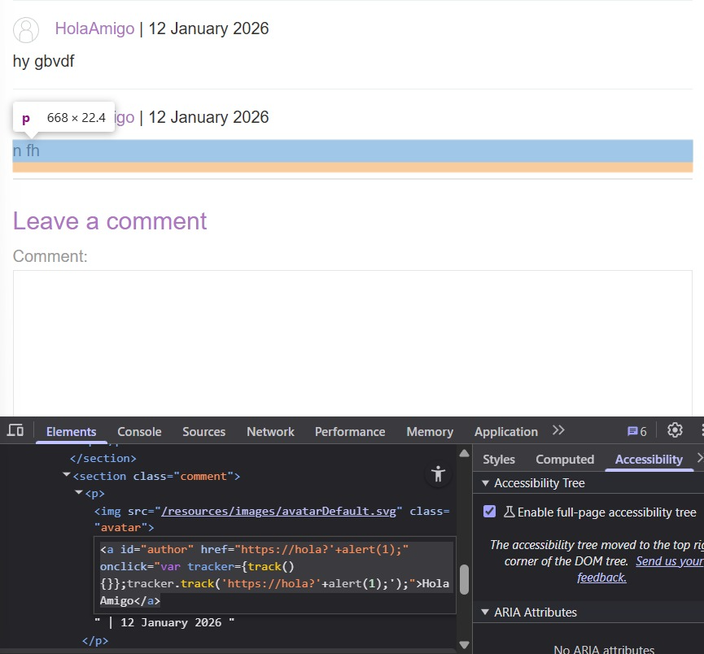
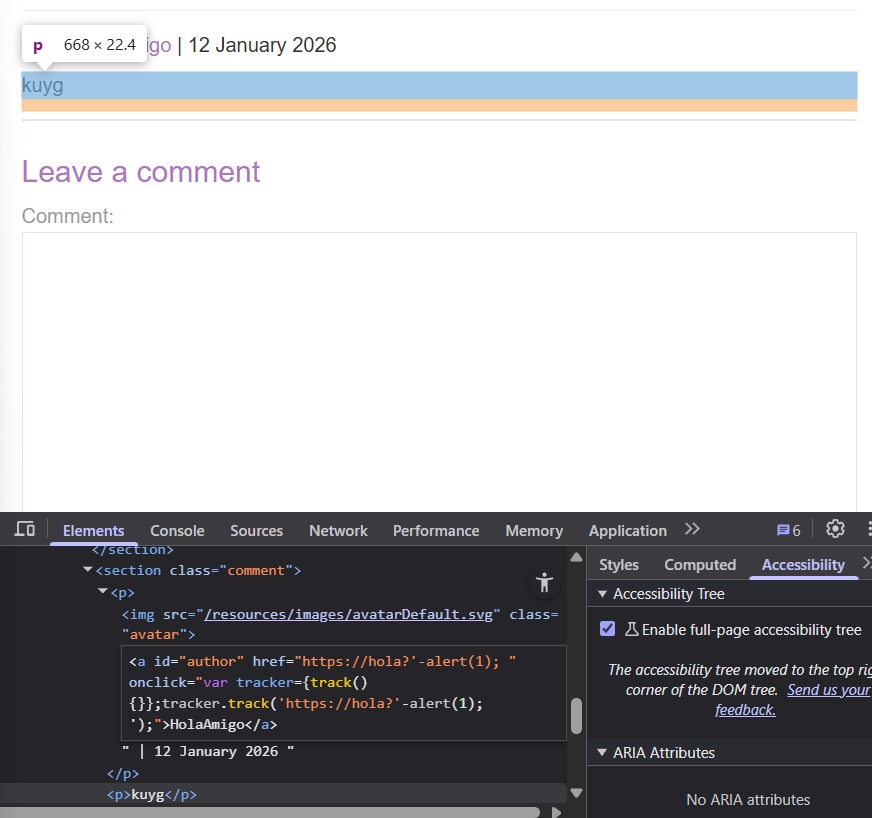
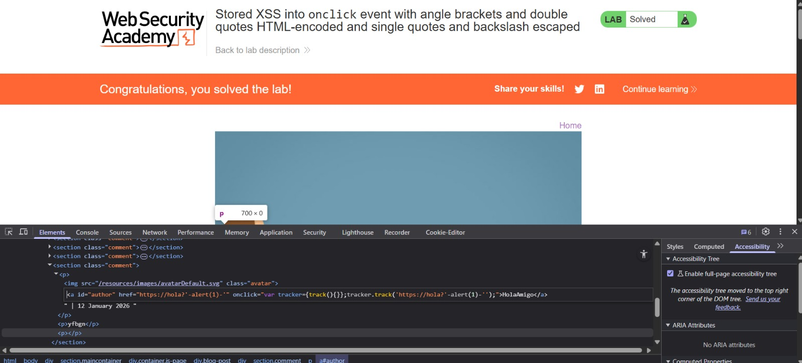

# Lab: Stored XSS into onclick event with angle brackets and double quotes HTML-encoded and single quotes and backslash escaped

**Difficulty:** Practitioner

**Link:** https://portswigger.net/web-security/cross-site-scripting/contexts/lab-onclick-event-angle-brackets-double-quotes-html-encoded-single-quotes-backslash-escaped

## Objective : This lab contains a stored cross-site scripting vulnerability in the comment functionality.To solve this lab, submit a comment that calls the alert function when the comment author name is clicked.

## Analysis
**Context:** Blog Comment, Elements Panel

**Sink:** The inputs are reflected in the `<a>` tag which is in following hierarchy : `blog-post -> 
 -> comments sections -> <a>` 

**Payloads/Inputs Used**: `https://hola?'+alert(1);` 
`https://hola?%27+alert(1);`
`https://hola?&#x27;+alert(1);`
`https://hola?&#x27;-alert(1)-&#x27;`

I gave a random inputs in the comment functionality of the web page, and inspected where the inputs are being stored. Found that, the inputs are stor in the `<a>` tag under the `blog-post` section.

`<a id="author" href="http:hola.com" onclick="var tracker={track(){}};tracker.track('http:hola.com');">HolaAmigo</a>`

After I got to know that through `onclick` the input is been stored, also we need to escape the `onclick` by using JavaScript. Firstly, then I checked whether direct tags are accepted and stored or any format is pre-defined.

A specific format for the input is already defined in the code so I tried to input this `https://hola?'+alert(1);`, as I thought that the acceptable format for the website section in the Blog Comment will start with http or https.

After submitting, I inspected that the single quotes has been escaped and will not be considered for execution. The single quote `'` got included in the URL, but I wanted it to be present seperately. 
The code written in the backend may have a functionality in which whenever the single quote `'` appears, it inserts a `\` infront of it by which the single quote `'` is being escaped. 

So I to dodge that, I need to provide the input enclosed in single quote. As `https://hola?'+alert(1);` didn't worked so I tried the same input but with the encoded part of the `'`. `https://hola?%27+alert(1);` was given as the input now.

It too didn't worked because the web page while taking the input is considering the encoded part and storing it as it's unencoded format.

Input given: `https://hola?%27+alert(1);`
Input considered and stored as: `https://hola?'+alert(1);` 

Then as the web page is considering HTML encoding so I tried the input with HTML encoded part of the single quote `'`.

`https://hola?&#x27;+alert(1);`

`<a id="author" href="https://hola?'+alert(1);" onclick="var tracker={track(){}};tracker.track('https://hola?'+alert(1);');">HolaAmigo</a>`

As we can see that now the alert(1) function exists seperately, so the HTML encoding works here. I've given the HTML encoded type of the input, so the input went directly into the backend's response, but when the browser reads the input, it will consider the HTML encoded part as a single quote.

It is showing up in the onclick, so after executing the `https://hola?&#x27;` part, it would want to remove the alert(1) part. But for that, the backend would have to run the alert(1) part. As soon as alert(1) runs, our payload will get executed and we will get what we wanted.

`https://hola?&#x27;-alert(1)-&#x27;`

